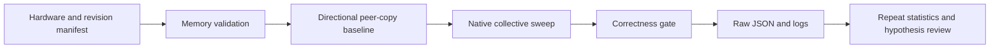

# Measurement contract

## Ordered pipeline

The runner uses one process and one thread with one NCCL rank per GPU. `CUDA_VISIBLE_DEVICES` defines physical device order. This is a single-node v1; MPI and multi-node NIC baselines are outside this implementation.

## Sampling and units

Default target run: 20 warmups, 100 timed iterations and 5 independent process repetitions, across 6 message sizes. Correctness is enabled. The recorded single-GPU smoke uses 5 warmups, 30 timed iterations and 3 repetitions.

Native per-iteration samples and the native run-average `time` measure different timing paths and are preserved separately. Cross-repetition p95 is a nearest-rank percentile over run means, not a percentile over GPU ranks. With few repeats it has coarse resolution. No GPU-rank timing distribution is invented when the non-MPI tool does not emit one.

The preflight copies 128 MiB per operation, with 5 warmups and 20 timed copies. Its reported GB/s is **payload bytes per second**, not twice the byte count, and is not asserted to be DRAM telemetry. The payload distinguishes source devices. If CUDA peer access is unavailable, the CUDA peer-copy baseline may use staging; `p2p_supported=false` remains in the evidence. Successful copying does not prove a direct P2P path.

## Configuration controls

Every candidate case changes one factor from `default`: GPU order, a registration mode, one allowed NCCL environment variable, or one CPU-affinity mask. Cases alternate order across repetitions. Multiple cases are not combined into a permanent tuning recommendation.

For a CPU-affinity hypothesis, add a case such as `{"name":"one-cpu","env":{},"cpu_affinity":[2]}` after verifying CPU 2 is in the available mask. Record the exact target-host NUMA placement. A more constrained mask may impair progress but that is an experimental result, not a foregone conclusion.

For a fault experiment on an isolated target host, an invalid socket interface can be expressed as a single `NCCL_SOCKET_IFNAME` override. Whether that affects an intra-node run depends on the selected path; a no-effect result must be retained. The repository does not change network configuration or inject faults into external services.

## Acceptance boundaries

Missing correctness, zero data, impossible units/bandwidth factors, incomplete iteration arrays, duplicate ranks, absent run termination and malformed native JSON are not accepted as evidence. Timeout kills and reaps the process group. No fixed bandwidth threshold is treated as a numerical failure.

GPU/NIC/CPU placement and actual transport need raw runtime evidence. An available network plugin is not evidence that payloads used it. The parser only records explicit channel-path lines; otherwise transport remains missing. A two-GPU performance finding still requires review of raw observations and a root-cause hypothesis before final qualification.
