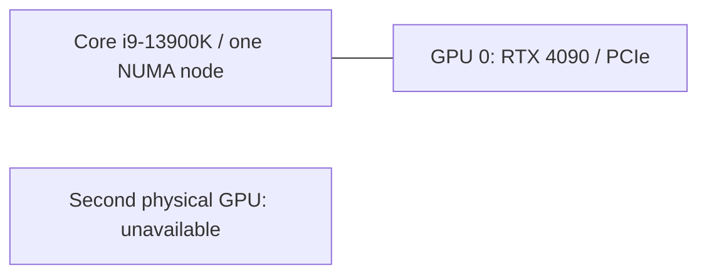

# Local experiment report

The local machine has one NVIDIA GeForce RTX 4090, an Intel Core i9-13900K and a single CPU NUMA node. The tested toolkit/driver runtime is CUDA 13.2. Full command output is retained in the snapshot manifests.

## Observation 1: a nominal all-gather can carry zero bytes

The initial 8-byte all-gather returned successfully with `nwrong=0`, yet native JSON reported `size=0` and `count=0`. The pinned tool rounds per-rank counts down to a 16-byte boundary. Such a run cannot establish payload correctness or bandwidth. The parser rejected the result; configuration validation was tightened to multiples of `16 × ranks`.

This finding is reproduced in `single-gpu-smoke/` and contrasted with the corrected runs in `single-gpu-validated/` and the final validation directory. It is a harness-input/measurement issue, not a claimed NCCL correctness defect.

## Observation 2: all single-GPU collective checks passed

Thirty process runs covered all-reduce and all-gather at 16 B, 1 KiB, 64 KiB, 1 MiB and 16 MiB, with three independent repeats. Each native result includes both in-place and out-of-place checks. Every accepted native payload has zero incorrect elements. `busbw=0` on one rank by definition; single-rank `algbw` is not presented as network performance.

## Remaining target hypothesis

**Hypothesis:** registration may change large-message latency on a particular two-GPU path. Run the default/registered cases with identical data size, rank order and timing settings, compare paired repetitions, and inspect the actual transport and peer-copy baseline. A null or adverse result is valid. Do not globally force an algorithm based on one improved case.

The required two-GPU placement/transport experiments, isolated target-host fault observations and resulting root-cause report are pending. The local preflight explicitly exits 2 for that configuration. No NVLink, NIC or RDMA measurement is inferred from this machine.
